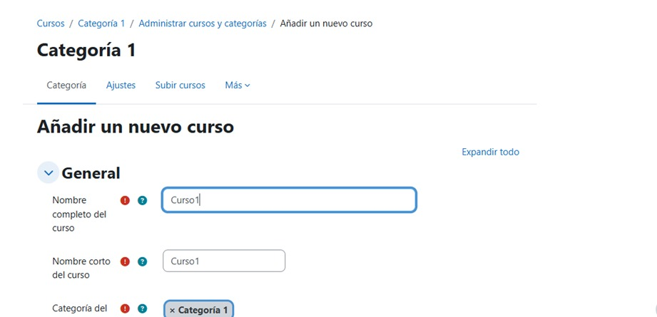
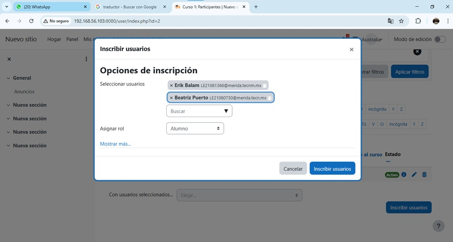
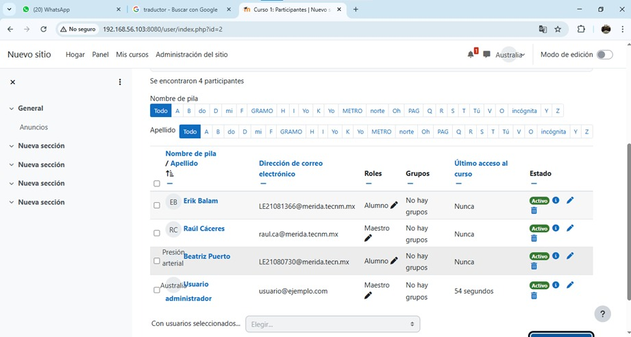

# Examen_DEV

Documentación para desplegar ***Moodle*** con una infraestructura basada en contenedores de DOCKER:

para realizae el despliegue se necesito clonar el repositorio donde se encuentra el archivo .yml:

~~~
git clone <URL>
~~~

***Nota:*** Este comando clonara los archivos de manera local.

---

Ingresa al repositorio clonado ***directorio clonado***.

---
## Paso 1. Entrar al directorio de moodle.

~~~
cd moodle-2
~~~

Entrar al directorio del ***moodle***.

---
## Paso 2. Compilar el docker-compose.yml.

~~~
docker-compose up -d
~~~

Compilación de archivo `docker-compose.yml`.

***Nota:*** Si desea detener la ejecución puede en algún momento más adelante, puede ejecutar el comando:

## Paso 3. Ingresar al Moodle.
ingrese en su navergador preferido y coloque la URL:

~~~
localhost:80
~~~

Esto debería desplegar un panel de ***Moodle***.

***Nota:*** Podrá iniciar sesión de haciendo ***click*** en ***login***.

	Usuario: user.
	Contraseña: bitnami.

---
## Paso 4. Creación de cursos.
Una vez dentro del ***moodle*** podemos crear cursos, para ello, debemos navegar por los apartados:
 Courses/category 1/manage courses and categories/Add new course

Ingresa los datos que te indican:

## Paso 5. Asignar usuarios y roles al curso.
Agregar usuarios al curso y asignando sus respectivos cursos

A continuación se habrá creado al curso ya que los usuarios y sus respectivos roles

